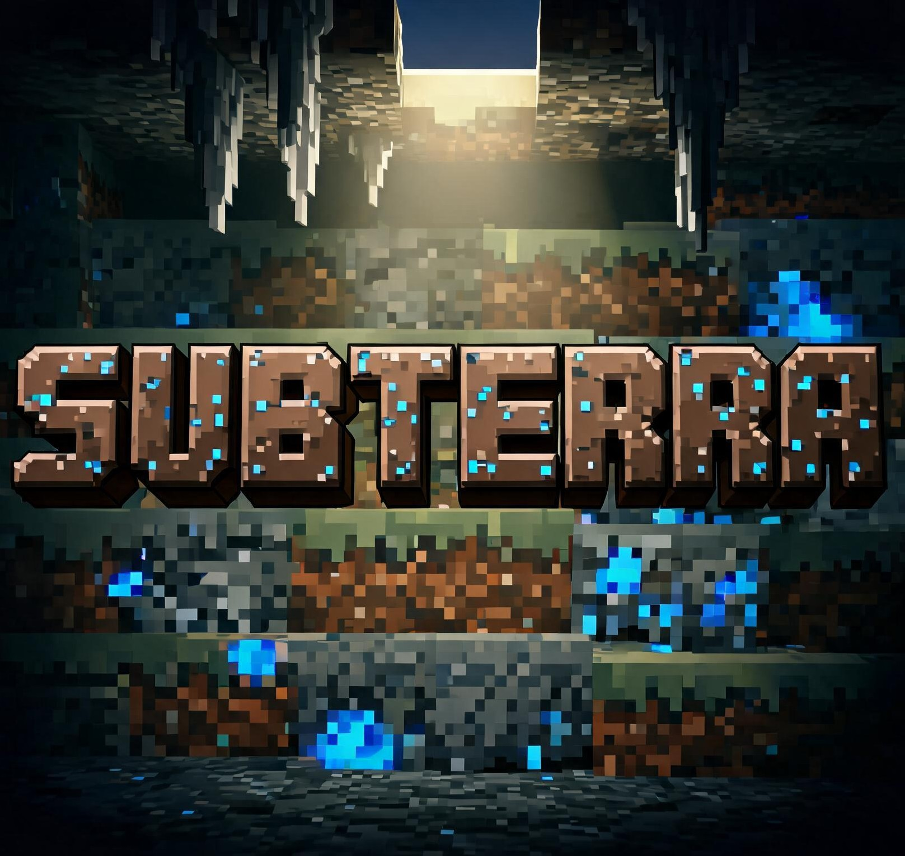

    

# Subterra

Subterra — 全栈开发框架模组（NeoForge 21.1.x / Minecraft 1.21.1），Toterra 系列的基础底座。单独安装时世界与 vanilla 一致，只增加优化与解耦原版核心机制的 API；使用框架 API 的模组可完全替换世界生成、动画、AI、HUD 与配置体系。

Subterra is a full-stack development framework mod (NeoForge 21.1.x / Minecraft 1.21.1), the foundation of the Toterra series. Installed alone the world matches vanilla — only optimizations and APIs that decouple vanilla core mechanics are added; mods consuming the framework APIs may fully replace worldgen, animation, AI, HUD, and the configuration system.

## Features / 功能

* vanilla 等价默认世界生成，p.1.8 保真工作固化为 golden tests / vanilla-equivalent default worldgen; the p.1.8 fidelity work is frozen as golden tests
* 九维世界生成框架（terrain / climate / vegetation / hydro / surface / litho / mineral / fauna / relic）/ nine-dimension worldgen framework
* td（tie:data）配置体系，一切配置零 json / td (tie:data) configuration — no json
* 优化集：ScratchPool / mobcap / activation / ticking-cache / FlowSched（C2ME 调度核心）等 / optimization set: ScratchPool, mobcap, activation, ticking-cache, FlowSched (C2ME scheduling core), ...
* 世界剖析工具链（统计 / 轴向切片 / 常驻增量）/ world profiler toolchain (stats, axis slices, residency)
* 日志 + 崩溃自动导出 + 模块依赖诊断 / logging + crash auto-export + dependency diagnosis

## Layout / 结构（p.2.0 起）

* `subterra-api` — 框架契约，纯 JDK，独立发布 jar / framework contract, pure JDK, standalone jar
* `subterra-engine` — 纯 JDK 引擎核心（worldgen / optim / config / log / export）/ pure-JDK engine core
* `subterra-runtime` — MC 层接线（source-host）/ MC-layer wiring (source-host)
* `subterra-migrate` — 旧 API → 新 API 迁移转化器 / migration translator
* `subterra-devkit` — 探针与开发工具，不进发布 jar / probes & dev tools, never shipped
* `subterra-tie` — tie 桥（经 `engine.tie.TieLibrary` 的 FFM 装载 + Trimand 微型扩散三定调器桥）/ tie bridge (FFM loading via `engine.tie.TieLibrary` + the Trimand micro-diffusion three-tone bridge)

## tie 侧源码 / tie-src

* **`subterra-tie`** — tie 桥模块：经 `engine.tie.TieLibrary` / `TieFunction` 的 FFM 装载链路调用
  tiec 编译的 DLL，并捆绑 **Trimand 微型扩散三定调器桥**（`TrimandBridge`，资源
  `/tie/subterra_diffuse.dll`，导出 `rfwd$coarse_climate / coarse_elev / coarse_mountain`，
  ABI `(i64,i64,i64) -> f64`）。缺 DLL 时确定性 skip，密度真值与缺省预设逐位不变。
* **`tie-src/`** — tie 语言编写的 Subterra 工作区（随仓库一起管理，按模块分子目录）。当前模块：
  * **`tie-src/trimand/`** — **Trimand 微型扩散三定调器**：给地形生成提供气候 / 海拔 / 山带三个宏观定调场
    （海岸线/水文由三者组合派生，非模型输出）。含 macrogen（三定调先验数据）、diffunet（5 输入
    3 输出 UNet，NPAR=1083，容量档位 1280）、trainer/train_full（训练入口）、runtime_forward +
    gen（自包含 DLL 运行时段生成，导出 `stdens::coarse_climate / coarse_elev / coarse_mountain`）、
    四组验收探针。设计见 [`tie-src/trimand/docs.md`](tie-src/trimand/docs.md)。
* 运行需 `tiec` 编译器与 tie 内置库（`--lib-root`），编译链：`tiec --lib-root <tlib> <target.tie>`。

## Roadmap / 路线图

路线图与框架设计详见 `docs/ROAD.md`（聚合仓库 `docs/2026-09-08-subterra-framework-design.md`）。/ See `docs/ROAD.md` and the framework design in the aggregate repo (`docs/2026-09-08-subterra-framework-design.md`).

## License

本仓库按 **Tie Public License v2.0（TPL 2.0）** 授权发布（全文见 [LICENSE](LICENSE)）：你可自由使用、修改并分发本软件源码，包括用于商业产品，仅需保留版权声明并附本许可证；而使用本框架开发的模组与作品完全归你所有，不附带任何署名义务。

EN: This repository is released under the **Tie Public License v2.0 (TPL 2.0)** (full text in [LICENSE](LICENSE)): you may freely use, modify, and redistribute the source code, including in commercial products, provided you retain the copyright notice and a copy of the license; mods and works you build with this framework are entirely your own, with no attribution obligation.

* **第三方声明 / Third-party notices**: 异步世界生成核心 `engine.worldgen.async` 为遵循 C2ME（MIT）并发模型的原创派生设计实现（非逐字复制），C2ME 依 MIT 许可署名；详见 [NOTICE](NOTICE)。/ The async worldgen core `engine.worldgen.async` is an original derived-design implementation following the C2ME (MIT) concurrency model (not a verbatim copy); C2ME attribution is provided under the MIT license, see [NOTICE](NOTICE).
